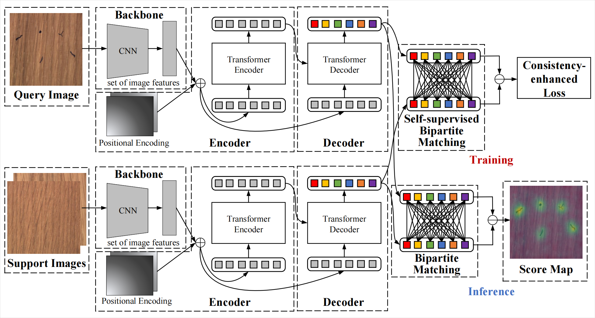

# ADFormer: Generalizable Few-Shot Anomaly Detection with Dual CNN-Transformer Architecture

## 💡 Introduction

<p align="center" style="border-radius: 10px">
  
</p>

In Generalizable Few-Shot Anomaly Detection (GFSAD), a common model must be learned and shared across several categories, while simultaneously ensuring that the model is adaptable to new categories with a restricted number of normal images. While CNN-transformer architectures obtain high success in many vision tasks, the potential of CNN-transformer architectures in GFSAD is still to be discovered. In this paper, we introduce **ADFormer**, a dual CNN-transformer architecture that combines the strengths of CNNs and transformers, with the aim of learning discriminative features that have both local and global receptive fields. We also incorporate a self-supervised bipartite matching approach in ADFormer that reconstructs query images from support images, followed by detecting anomalies based on the high loss in reconstruction. Additionally, we present a consistency-enhanced loss to enhance the spatial and semantic consistency of features, thereby reducing the dependence on a large AD dataset for training. Experimental results show that ADFormer with consistency-enhanced loss significantly improves GFSAD performance. Compared to other anomaly detection methods, ADFormer outperforms considerably on the MVTec AD, MPDD, and VisA datasets.

## Dataset
We follow [RegAD](https://github.com/MediaBrain-SJTU/RegAD) for the dataset preparation. 

Download the support dataset for few-shot anomaly detection on [Google Drive](https://drive.google.com/file/d/1AZcc77cmDfkWA8f8cs-j-CUuFFQ7tPoK/view?usp=sharing) or [Baidu Disk](https://pan.baidu.com/s/1GZAqtscOaPliaFCiSKlViA) (i9rx)
and unzip the dataset. For those who have problem downloading the support set, please optional download categories of capsule and grid on [Baidu Disk](https://pan.baidu.com/s/1fFwAB__bV0ja38B4w3JnXQ) (pll9) and [Baidu Disk](https://pan.baidu.com/s/1_--hXPPnlv3Tv7HHd4HRZQ) (ns0n).

## 🔥 Training 

```bash
python train.py
```

## 💻 Evaluation

```bash
python test.py
```

## 🤗Acknowledgements

- Thanks to [MaskFormer](https://github.com/facebookresearch/MaskFormer) and [RegAD](https://github.com/MediaBrain-SJTU/RegAD) for their wonderful work and code!

## 📖BibTeX

```
@article{zhu2024adformer,
  title={ADFormer: Generalizable Few-Shot Anomaly Detection with Dual CNN-Transformer Architecture},
  author={Zhu, Bingke and Gu, Zhaopeng and Zhu, Guibo and Chen, Yingying and Tang, Ming and Wang, Jinqiao},
  journal={IEEE Transactions on Instrumentation and Measurement},
  year={2024},
  publisher={IEEE}
}
```

